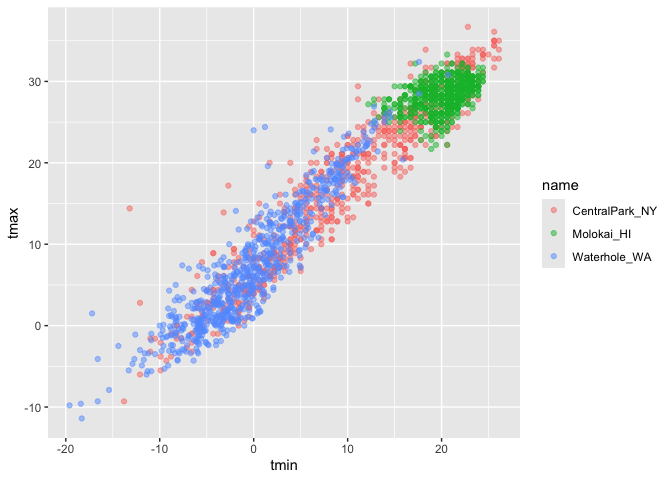
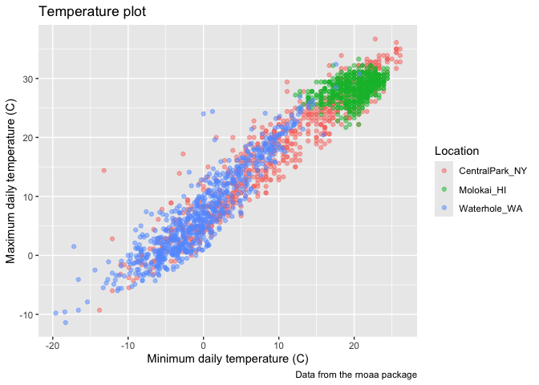
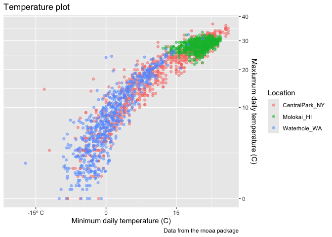
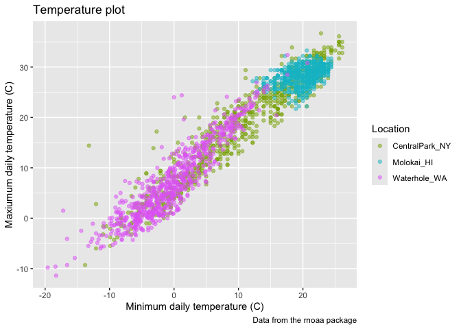
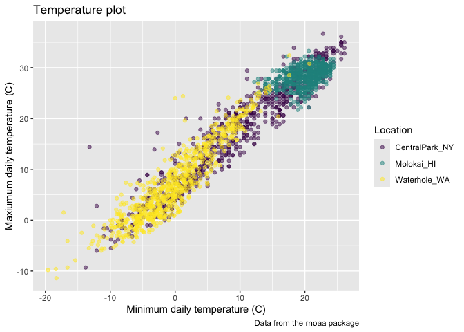
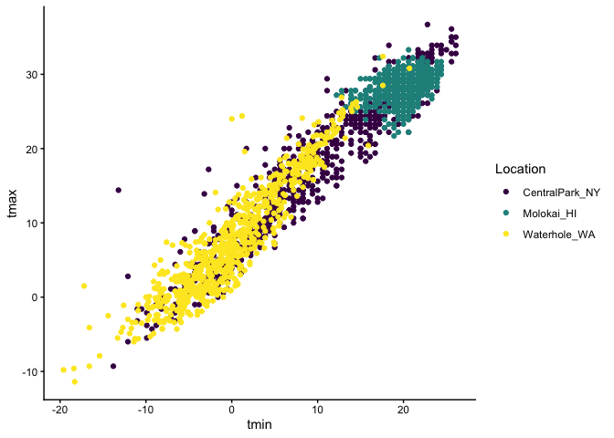
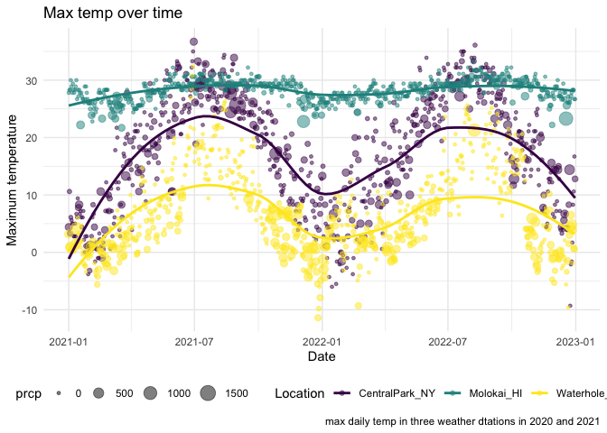

02_viz
================
di2251
2026-10-06

``` r
library(tidyverse)
library(patchwork)
library(wesanderson)

library(p8105.datasets)
data("weather_df")
```

Revisit scatterplot

``` r
weather_df |>
  ggplot(aes(x = tmin, y = tmax)) +
  geom_point(aes(color = name), alpha = .5)
```

<!-- -->

### Labels

Provide informative axis labels, plot titles, and captions using
`labs()`

``` r
weather_df |>
  ggplot(aes(x = tmin, y = tmax)) +
  geom_point(aes(color = name), alpha = .5) +
  labs(
    title = "Temperature plot",
    x = "Minimum daily temperature (C)",
    y = "Maximum daily temperature (C)",
    color = "Location",
    caption = "Data from the rnoaa package"
  )
```

<!-- -->

### Scales

``` r
weather_df |>
  ggplot(aes(x = tmin, y = tmax)) +
  geom_point(aes(color = name), alpha = .5) +
  labs(
    title = "Temperature plot",
    x = "Minimum daily temperature (C)",
    y = "Maxiumum daily temperature (C)",
    color = "Location",
    caption = "Data from the rnoaa package") + 
  scale_x_continuous(
    breaks = c(-15, 0, 15),
    labels = c("-15º C", "0", "15")) +
  scale_y_continuous(
    trans = "sqrt",
    position = "right")
```

<!-- -->

Color adjusting

``` r
weather_df |> 
  ggplot(aes(x = tmin, y = tmax)) + 
  geom_point(aes(color = name), alpha = .5) + 
  labs(
    title = "Temperature plot",
    x = "Minimum daily temperature (C)",
    y = "Maxiumum daily temperature (C)",
    color = "Location",
    caption = "Data from the rnoaa package") + 
  scale_color_hue(h = c(100, 300))
```

<!-- -->

Use `viridis` package color palette

``` r
ggp_temp_plot = 
  weather_df |> 
  ggplot(aes(x = tmin, y = tmax)) + 
  geom_point(aes(color = name), alpha = .5) + 
  labs(
    title = "Temperature plot",
    x = "Minimum daily temperature (C)",
    y = "Maxiumum daily temperature (C)",
    color = "Location",
    caption = "Data from the rnoaa package"
  ) + 
  viridis::scale_color_viridis(
    name = "Location", 
    discrete = TRUE 
  )

ggp_temp_plot
```

<!-- -->

Use `discrete = TRUE` because the `color` aesthetic is mapped to a
discrete variable

### Themes

``` r
weather_df |>
  ggplot(aes(x = tmin, y = tmax, color = name)) +
  geom_point() +
  viridis::scale_color_viridis(
    name = "Location",
    discrete = TRUE
  ) +
  theme_classic()
```

<!-- -->

``` r
  theme(legend.position = "bottom")
```

    ## <theme> List of 1
    ##  $ legend.position: chr "bottom"
    ##  @ complete: logi FALSE
    ##  @ validate: logi TRUE

### Setting options

``` r
weather_df |>
  ggplot(aes(x = date, y = tmax, color = name)) +
  geom_point(aes(size = prcp), alpha = .5) +
  geom_smooth(se = FALSE) +
  viridis::scale_color_viridis(
    name = "Location",
    discrete = TRUE
  ) +
  theme_classic() +
  theme(legend.position = "bottom") +
  labs(
    title = "Max temp over time",
    x = "Date",
    y = "Maximum temperature",
    caption = "max daily temp in three weather dtations in 2020 and 2021"
  ) +
  theme_minimal() +
  theme(legend.position = "bottom")
```

    ## `geom_smooth()` using method = 'loess' and formula = 'y ~ x'

<!-- -->

Multiple panels with different plot types.

``` r
ggp_tmax_tmin = 
  weather_df |>
  ggplot(aes(x = tmin, y = tmax, color = name)) +
  geom_point() +
  theme(legend.position = "none")

ggp_prcp_density = 
  weather_df |>
  filter(prcp > 0) |>
  ggplot(aes(x = prcp, fill = name)) +
  geom_density(alpha = .5) +
  theme(legend.position = "none")

ggp_seasonal = 
  weather_df |>
  ggplot(aes(x = date, y = tmax, color = name)) +
  geom_point() +
  theme(legend.position = "bottom")

(ggp_tmax_tmin + ggp_prcp_density) / ggp_seasonal
```

    ## Warning: Removed 17 rows containing missing values or values outside the scale range
    ## (`geom_point()`).
    ## Removed 17 rows containing missing values or values outside the scale range
    ## (`geom_point()`).

<!-- -->
